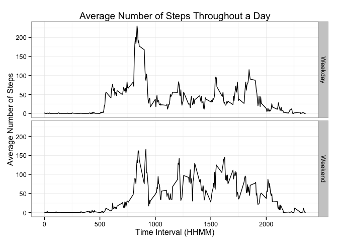

##Tracking Activity Using A Monitoring Device
<p style="font-size: 13pt; line-height:18pt"> 
**Author:** Florence Lee<br>
**Date:** 02-15-2015<br>
**Assignment:** RepData_PeerAssessment1</p>

====

###Introduction
The purpose of this assignment is to explore data from a personal activity
monitoring device. The device collects step data every 5 minutes, and this 
dataset only captures data from 10-01-2012 to 11-30-2012.

###Unzip and Read Dataset
After forking the RepData_PeerAssessment1 folder from Github, set the working 
directory to the forked repo ```RepData_PeerAssessment1```. Unzip ```activity.zip```, 
which contains the .csv file with the data, and read with ```read.csv()```. Here,
I set the ```stringsAsFactor``` argument to ```FALSE``` because I want to read
all character vector columns as characters and not factors for now.


```r
unzip("activity.zip") 
activity <- read.csv("activity.csv", stringsAsFactor=FALSE)
```

###Explore & Clean the Dataset
The first order of business is to explore the dataset. This can be done using 
```str```.


```r
str(activity)
```

```
## 'data.frame':	17568 obs. of  3 variables:
##  $ steps   : int  NA NA NA NA NA NA NA NA NA NA ...
##  $ date    : chr  "2012-10-01" "2012-10-01" "2012-10-01" "2012-10-01" ...
##  $ interval: int  0 5 10 15 20 25 30 35 40 45 ...
```

The variables ```steps``` and ```interval``` are both integer values, which is
what we want. ```date```, however, should be in a date format, so let's do that:


```r
activity$date <- as.Date(activity$date, "%Y-%m-%d")
```

If you run ```str(activity)``` again, you will see that ```date``` is now a 
Date variable. 

Additionally, we see that there are some NAs in ```steps```, which is a bit
unusual. To see what's going on, we can see how many NAs there are for each date
in the dataset. Here, we use ```dplyr``` to manipulate the dataset, but there
are base R functions that can help you do the same things, too.


```r
library(dplyr)
```


```r
activity_na <- summarise(group_by(activity, date), total_NAs=sum(is.na(steps)))
date_na <- activity_na[which(activity_na$total_NAs > 0),]
date_na
```

```
## Source: local data frame [8 x 2]
## 
##         date total_NAs
## 1 2012-10-01       288
## 2 2012-10-08       288
## 3 2012-11-01       288
## 4 2012-11-04       288
## 5 2012-11-09       288
## 6 2012-11-10       288
## 7 2012-11-14       288
## 8 2012-11-30       288
```

There is missing data for 8 of the days, which can be due to a number of reasons,
which we can only speculate. This is just good to keep in mind when we proceed
with analysis.

###What is the mean total number of steps taken per day?

Let's take a look at the mean total number of steps taken per day. In order to
do this calculation, we will need to:

1. Calculate the total number of steps taken per day. 
2. Make a histogram of the total number of steps taken per day. 
3. Calculate the mean and median of the total number of steps taken per day. 

**Total Number of Steps Taken Per Day**

In order to do the calculation, we need to sum ```steps``` by ```date``` and 
ignore all the ```NAs```. 


```r
day_steps <- summarise(group_by(activity, date), 
                       total_steps=sum(steps, na.rm=TRUE))
day_steps
```

```
## Source: local data frame [61 x 2]
## 
##          date total_steps
## 1  2012-10-01           0
## 2  2012-10-02         126
## 3  2012-10-03       11352
## 4  2012-10-04       12116
## 5  2012-10-05       13294
## 6  2012-10-06       15420
## 7  2012-10-07       11015
## 8  2012-10-08           0
## 9  2012-10-09       12811
## 10 2012-10-10        9900
## ..        ...         ...
```

Because we ignored all the ```NAs``` the sum of steps for dates with no data 
reads as 0. We can now use the ```total_steps``` column we created to create
a histogram.

**Distribution of Total Steps Taken Per Day**


```r
hist(x = day_steps$total_steps, breaks = 10, 
     xlab = "Total Steps Taken Per Day", 
     ylim = c(0, 25), 
     xlim = c(0, 25000),
     main = "Total Steps Taken Per Day from October 2012 to November 2012")
```

 

The distribution of Total Steps Taken Per Day looks slightly left-skewed, so 
we would expect to see the mean to the left of the median.

**Mean and Median**

We can calculate the mean and median of the distribution using the ```mean()```
and ```median()``` functions. Be sure to ignore the ```NAs```.


```r
mean(day_steps$total_steps, na.rm=TRUE)
```

```
## [1] 9354.23
```

```r
median(day_steps$total_steps, na.rm=TRUE)
```

```
## [1] 10395
```

####What is the average daily activity pattern?

Average daily activity pattern can be captured by executing the following steps:

1. Calculate average number of steps over each time interval.
2. Graph a time series that captures average number of steps over time.

**Average Number of Steps Over Time Interval**

First, we want to group the data by ```interval``` and then calculate the mean
number of steps through that interval.


```r
int_steps <- summarise(group_by(activity, interval), 
                       mean_steps=mean(steps, na.rm=TRUE))
int_steps
```

```
## Source: local data frame [288 x 2]
## 
##    interval mean_steps
## 1         0  1.7169811
## 2         5  0.3396226
## 3        10  0.1320755
## 4        15  0.1509434
## 5        20  0.0754717
## 6        25  2.0943396
## 7        30  0.5283019
## 8        35  0.8679245
## 9        40  0.0000000
## 10       45  1.4716981
## ..      ...        ...
```

**Time Series of Average Steps Over Time**

The best way to visualize data over time is to create a time-series with time 
on the x-axis. 


```r
plot(x = int_steps$interval, y = int_steps$mean_steps, type = "l", 
     xlab = "Time Interval (HHMM)", 
     ylab = "Average Number of Steps", 
     main = "Average Number of Steps Throughout a Day")
```

 

**Finding the Max Number of Average Steps**

We can find the interval where the graph peaks by using the ```max()``` function:


```r
int_steps$interval[which(int_steps$mean_steps==max(int_steps$mean_steps))]
```

```
## [1] 835
```

The maximum number of steps can be found at time interval 835 (which corresponds
to 8:35AM).

####Imputing missing values

Previously, we had calculated to see how many NAs there were in the dataset for
exploratory purposes. We will now impute reasonable values for missing data in 
order to avoid systematic bias.

**Total Number of Missing Values**

First, let's see how many rows, or observations, in our dataset have ```NAs```. 
This can be accomplished with the ```complete.cases()``` function.


```r
sum(!complete.cases(activity))
```

```
## [1] 2304
```

There are 2,304 observations that have NAs in our dataset. 

**Imputing Values for Missing**

As we saw previously, these missing values are concentrated in 8 days of data
collection. For these days, data is missing for *all* 288 time intervals. Thus, 
we can impute missing values using the average steps for each time interval. Our
imputation datset will be ```int_steps``` and dates we want to 
impute values for is listed in ```date_na```. Both were previously created.


```r
activity_nomiss <- activity
for (i in date_na$date) {
     activity_nomiss$steps[which(activity_nomiss$date==i)] <- int_steps$mean_steps
}
```

If we run a quick count of missing ```steps``` values in ```activity```, we see
there are no observations with missing values in the new dataset ```activity_nomiss```.


```r
sum(!complete.cases(activity_nomiss))
```

```
## [1] 0
```

**Reevaluate Total Steps Taken Per Day**

Now, we want to re-evaluate total steps taken per day by recreating the histogram
and recalculating the mean and median.


```r
day_steps2 <- summarise(group_by(activity_nomiss, date), 
                       total_steps=sum(steps, na.rm=TRUE))
day_steps2
```

```
## Source: local data frame [61 x 2]
## 
##          date total_steps
## 1  2012-10-01    10766.19
## 2  2012-10-02      126.00
## 3  2012-10-03    11352.00
## 4  2012-10-04    12116.00
## 5  2012-10-05    13294.00
## 6  2012-10-06    15420.00
## 7  2012-10-07    11015.00
## 8  2012-10-08    10766.19
## 9  2012-10-09    12811.00
## 10 2012-10-10     9900.00
## ..        ...         ...
```


```r
hist(x = day_steps2$total_steps, breaks = 10, 
     xlab = "Total Steps Taken Per Day", 
     ylim = c(0, 25), 
     xlim = c(0, 25000),
     main = "Total Steps Taken Per Day from October 2012 to November 2012")
```

 


```r
mean(day_steps2$total_steps)
```

```
## [1] 10766.19
```

```r
median(day_steps2$total_steps)
```

```
## [1] 10766.19
```

If we impute missing values with the average number of steps for each 5-minute
interval and redraw the distribution of total number of steps taken per day,
the distribution becomes less skewed and more normal--drawing the mean closer 
to the median. (We effectively shifted some of the values on the left tail
closer to the middle.)

####Comparing Weekday with Weekend Values

If we are interested in comparing activity on the weekdays with activity on 
the weekends, we will have to create a new column ```wkday``` that tracks whether
the date is a weekday or a weekend. 


```r
for (i in seq_along(activity_nomiss$date)) { 
     if (weekdays(activity_nomiss$date[i]) %in% c("Sunday", "Saturday")) {
          activity_nomiss$wkday[i] <- "Weekend"
     }
     else {
          activity_nomiss$wkday[i] <- "Weekday"
     }
}
```

Because we want to later create a panel plot split by ```wkday```, we have to 
make sure ```wkday``` is a factor variable.


```r
activity_nomiss$wkdy <- as.factor(activity_nomiss$wkday)
str(activity_nomiss)
```

```
## 'data.frame':	17568 obs. of  5 variables:
##  $ steps   : num  1.717 0.3396 0.1321 0.1509 0.0755 ...
##  $ date    : Date, format: "2012-10-01" "2012-10-01" ...
##  $ interval: int  0 5 10 15 20 25 30 35 40 45 ...
##  $ wkday   : chr  "Weekday" "Weekday" "Weekday" "Weekday" ...
##  $ wkdy    : Factor w/ 2 levels "Weekday","Weekend": 1 1 1 1 1 1 1 1 1 1 ...
```

Now that we have a ```wkday``` variable, we want to create a dataset that 
contains the average number of steps for each time interval-weekday pair. We can 
use the ```summarise()``` function in the dplyr package as we did before, with 
an additional ```group_by``` variable.


```r
int_steps2 <- summarise(group_by(activity_nomiss, interval, wkdy), 
                        mean_steps=mean(steps, na.rm=TRUE))
int_steps2
```

```
## Source: local data frame [576 x 3]
## Groups: interval
## 
##    interval    wkdy  mean_steps
## 1         0 Weekday 2.251153040
## 2         0 Weekend 0.214622642
## 3         5 Weekday 0.445283019
## 4         5 Weekend 0.042452830
## 5        10 Weekday 0.173165618
## 6        10 Weekend 0.016509434
## 7        15 Weekday 0.197903564
## 8        15 Weekend 0.018867925
## 9        20 Weekday 0.098951782
## 10       20 Weekend 0.009433962
## ..      ...     ...         ...
```

**Creating Panel Plot**

Now that we have our dataset, we can create our panel plot. The ```ggplot```
package has a nice function for creating facet grids.


```r
library(ggplot2)
```


```r
#Create base of the graph
base <- ggplot(int_steps2, aes(x = interval, y = mean_steps)) + geom_line()
#Create facet
facet <- facet_grid(wkdy ~ .) 
#Graph theme
theme <- theme_bw()
#Title and axis labels
labels <- labs(title = "Average Number of Steps Throughout a Day", 
               x = "Time Interval (HHMM)", 
               y = "Average Number of Steps")
#Graph
base + facet + labels + theme
```

 

Based on the graph, we see that there is a difference when comparing activity
levels on the weekends with activity levels on the weekdays:

* On the weekday, more steps can be observed during the early hours of the day, 
which might coincide with travel to work. 
* On the weekends, more steps can be observed throughout the day and during the
later hours of the day.
